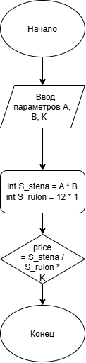

# Домашнее задание к работе 2

## Условие задачи
В течение месяца продавец доставлял на дом 4 л. молока в день. В марте молоко стоило **x** руб. за литр. С первого апреля цена молока увеличилась на **(x + a)** руб. за литр. Сколько надо заплатить продавцу за все доставленное молоко в конце апреля? Количество покупаемого молока осталось прежним.

## 1. Алгоритм и блок-схема

### Алгоритм
1. **Начало**
2. Задать исходные данные:
   - `A` = `8` - Ширина стены
   - `B` = `3` - Длина стены
   - `K` = `50` - Цена рулона
3. Вычислить площадь стены:
   - `S_stena` = `A` * `B`
4. Вычислить площадь одного рулона:
   - `S_rulon` = 12 * 1;
5. Вычислить стоимость обоев для поклея:
   - `price` = `S_stena` / `S_rulon` * `K`
6. Вывести результаты расчетов с подстановкой всех значений в текст.
7. **Конец**

### Блок-схема
 

 [Вставьте ссылку на изображение вашей блок-схемы, созданной в draw.io^](# "как lab_2_schema.png")

## 2. Реализация программы

#include <stdio.h>
#include <locale.h>

int main(void) {
	setlocale(LC_CTYPE, "");
	// Шаг 1: Задание конкретных значений переменных
	int A = 8; // Ширина стены
	int B = 3; // Длина стены
	int K = 50; // Цена одного рулона
	
	// Шаг2: Расчет площади стены
	int S_stena = A * B;
	
	// Шаг3: Расчет площади одного рулона 
	int S_rulon = 12 * 1;
	
	// Шаг4: Расчет цены итоговой цены обоев 
	int price = S_stena / S_rulon * K;
	
	// Форматированный вывод результатов
	printf("РАСЧЕТ СТОИМОСТИ ЦЕНЫ ОБОЕВ\n");
	printf("================================\n\n");
	printf("УСЛОВИЯ:\n");
	printf("- Цена 1 рулона: %d руб.\n", K);
	printf("- Площать одного рулона: %d м2\n", S_rulon);
	printf("- Длина, ширина и площадь стены: %d м %d м %d м2.\n", A, B, S_stena);
	printf("- Колличество рулонов: %d \n", S_stena / S_rulon);
	
	printf("РАСЧЕТ:\n");
	printf("- Цена поклейки: %d / %d * %d = %d.\n", S_stena, S_rulon, K, price);
	
}

## 3. Результаты работы программы

РАСЧЕТ СТОИМОСТИ ЦЕНЫ ОБОЕВ
================================

УСЛОВИЯ:
- Цена 1 рулона: 50 руб.
- Площать одного рулона: 12 м2
- Длина, ширина и площадь стены: 8 м 3 м 24 м2.
- Колличество рулонов: 2
РАСЧЕТ:
- Цена поклейки: 24 / 12 * 50 = 100.

## 4. Информация о разработчике

Балнов Артем бОТИ-262

